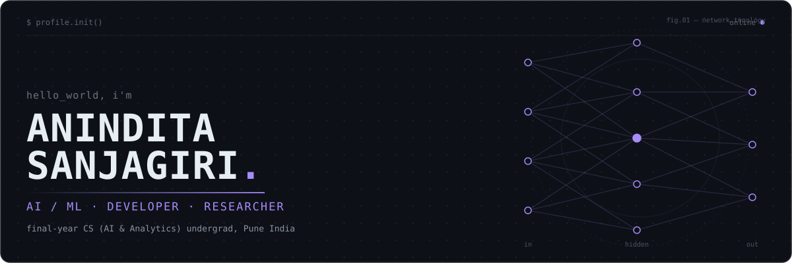
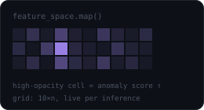

<div align="center">



<br><br>

[](https://git.io/typing-svg)

<br>

<a href="https://github.com/AninditaSanjagiri"></a>
<a href="https://www.linkedin.com/in/anindita-sanjagiri-a04989233/"></a>
<a href="mailto:anindita.sanjagiri@gmail.com"></a>
<a href="https://leetcode.com/u/Anindita_Sanjagiri/"></a>
<a href="#"></a>
<!-- swap the "#" above for a hosted resume link — see notes at the bottom -->

<br><br>

<code>01 <a href="#about">about.me</a></code> &nbsp;&#183;&nbsp;
<code>02 <a href="#now">currently.exe</a></code> &nbsp;&#183;&nbsp;
<code>03 <a href="#stack">tech_stack.json</a></code> &nbsp;&#183;&nbsp;
<code>04 <a href="#projects">featured_projects/</a></code> &nbsp;&#183;&nbsp;
<code>05 <a href="#research">research_lab/</a></code> &nbsp;&#183;&nbsp;
<code>06 <a href="#stats">github_stats.py</a></code> &nbsp;&#183;&nbsp;
<code>07 <a href="#connect">connect.sh</a></code>

</div>

<br>

<a name="about"></a>

### `01` `about.me`

I'm a final-year engineering student who builds ML systems that touch real data and real constraints — not just notebooks that stop at a validation score. Most of my work sits across NLP, computer vision, and applied security: multi-model pipelines, honest evaluation, and shipping something that actually runs.

I spent a summer at **Bajaj Finance** deploying speech-to-text pipelines on Databricks and training risk-classification models for underwriting. It's mostly why I care about the boring parts now — data validation, explainability, latency — as much as the model itself.

<br>

<a name="now"></a>

### `02` `currently.exe`

```
→ PyTorch                          [ deepening ]
→ Vision Transformers               [ exploring ]
→ Anomaly Detection                 [ building  ]
→ Research paper reproduction       [ ongoing   ]
→ MLOps & model deployment          [ learning  ]
→ Generative AI / model optimisation[ exploring ]
```

<br>

<a name="stack"></a>

### `03` `tech_stack.json`

**Languages**


**ML / AI**


**Systems &amp; Tools**


<sub>`Pandas` `NumPy` `Transformers (HF)` `Databricks` — not all libraries have icons, so these are listed in text.</sub>

<br>

<a name="projects"></a>

### `04` `featured_projects/`

<table>
<tr>
<td width="50%" valign="top">

**`01`  PhishNet** — multimodal phishing detection

Three models running in parallel — Random Forest on URL features, DistilBERT on page text, MobileNetV3 on screenshots — fused into one verdict with SHAP/LIME explanations attached. Sub-200ms end to end on CPU.

 

`FastAPI` `PyTorch` `Transformers` `SHAP` `React`

[→ view repository](https://github.com/AninditaSanjagiri/Phishnet)

</td>
<td width="50%" valign="top">

**`02`  Facial Emotion Recognition**

A CNN trained for real-time facial-expression classification, taken from a 20% baseline to 60% accuracy through augmentation and hyperparameter tuning, optimised to run live on standard hardware.

 

`TensorFlow` `Keras` `OpenCV`

[→ view repository](https://github.com/AninditaSanjagiri/facial-emotion-recognition-cnn)

</td>
</tr>
<tr>
<td width="50%" valign="top">

**`03`  Bio-Aligned Fit**

A data-driven look at how workout recommendations should shift across hormonal phases — an ML pipeline over physiological and lifestyle inputs, evaluated on precision/recall, shipped as a Streamlit app.

 

`scikit-learn` `Pandas` `Streamlit`

[→ view repository](https://github.com/AninditaSanjagiri/BioAligned-Fit)

</td>
<td width="50%" valign="top">

**`04`  CourseRecommender**

A hybrid content-based + collaborative-filtering engine that recommends courses from past ratings and genre similarity — recommender-systems groundwork the flashier projects build on.

 

`Pandas` `scikit-learn`

[→ view repository](https://github.com/AninditaSanjagiri/CourseRecommender)

</td>
</tr>
</table>

<div align="right"><sub><a href="https://github.com/AninditaSanjagiri?tab=repositories">view all repositories →</a></sub></div>

<br>

<a name="research"></a>

### `05` `research_lab/`

<table>
<tr>
<td width="60%" valign="top">

```
ACTIVE AREAS

→ Computer Vision
→ Anomaly Detection
→ NLP & Foundation Models
→ Research paper reproduction
→ Applied deep learning systems
```

I care less about squeezing out an extra point of accuracy and more about *why* a model fails — where the baseline breaks, what the edge cases look like, whether the result reproduces.

</td>
<td width="40%" align="center">

</td>
</tr>
</table>

<br>

<a name="stats"></a>

### `06` `github_stats.py`

<table>
<tr>
<td width="50%">

</td>
<td width="50%">

</td>
</tr>
</table>


**`> contribution_graph.exe`**


<br>

<a name="connect"></a>

### `07` `connect.sh`

```
$ cat contact.txt

github     → github.com/AninditaSanjagiri
linkedin   → linkedin.com/in/anindita-sanjagiri
email      → anindita.sanjagiri@gmail.com
leetcode   → leetcode.com/u/Anindita_Sanjagiri
```

<br>

<div align="center">
<sub>start from the problem, not the model.</sub>
</div>
