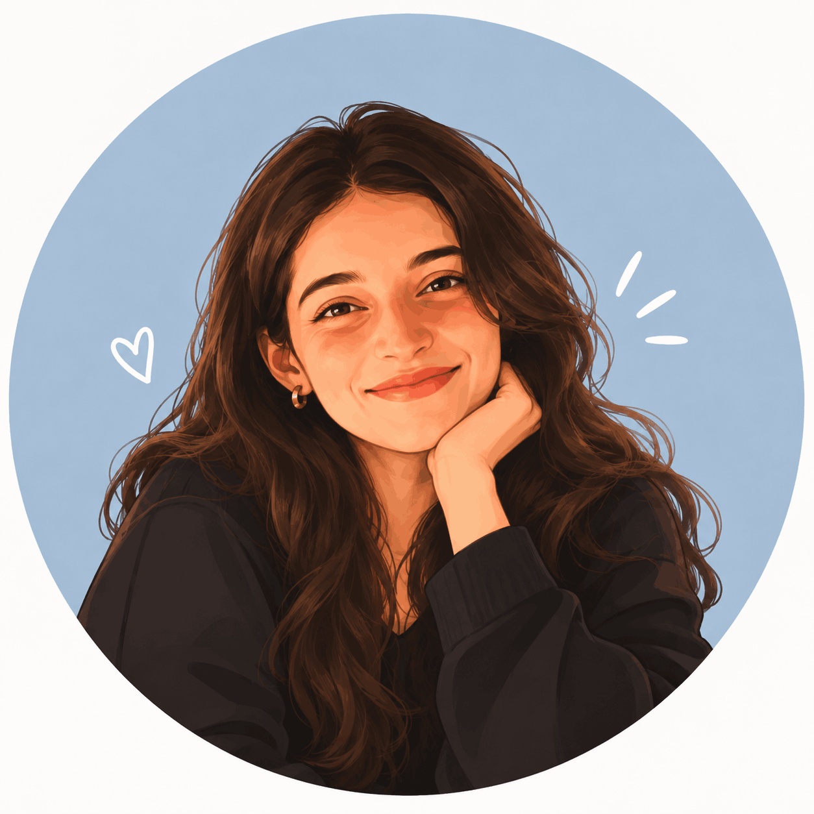

<div align="center">


<table>
<tr>
<td width="60"></td>
<td align="center"></td>
<td width="60"></td>
</tr>
</table>

[+student;building+ML+things+%2B+learning+in+public;computer+vision+%C2%B7+nlp+%C2%B7+applied+ml)](https://git.io/typing-svg)

<br>

<a href="https://github.com/AninditaSanjagiri"></a>
<a href="https://www.linkedin.com/in/anindita-sanjagiri-a04989233/"></a>
<a href="mailto:anindita.sanjagiri@gmail.com"></a>
<a href="https://leetcode.com/u/Anindita_Sanjagiri/"></a>
<a href="#"></a>
<!-- swap the "#" above for a hosted resume link -->

<br><br>

<code>01 <a href="#about">about.me</a></code> &nbsp;&#183;&nbsp;
<code>02 <a href="#now">currently</a></code> &nbsp;&#183;&nbsp;
<code>03 <a href="#stack">tech.stack</a></code> &nbsp;&#183;&nbsp;
<code>04 <a href="#projects">projects</a></code> &nbsp;&#183;&nbsp;
<code>05 <a href="#research">interests</a></code> &nbsp;&#183;&nbsp;
<code>06 <a href="#stats">stats</a></code> &nbsp;&#183;&nbsp;
<code>07 <a href="#connect">connect</a></code>

</div>

<br>

<a name="about"></a>

### `01` about.me 🩵

I'm a final-year engineering student building ML systems that touch real data and real constraints — not just notebooks that stop at a validation score. Most of my work sits across NLP, computer vision, and applied security: multi-model pipelines, honest evaluation, and shipping something that actually runs.

I spent a summer at **Bajaj Finance** deploying speech-to-text pipelines on Databricks and training risk-classification models for underwriting. It's mostly why I care about the unglamorous parts now — data validation, explainability, latency — as much as the model itself.

<br>

<a name="now"></a>

### `02` currently 🌱

```
→ PyTorch
→ Vision Transformers
→ Anomaly Detection
→ Research paper reproduction
→ MLOps & model deployment
→ Generative AI / model optimisation
```

<br>

<a name="stack"></a>

### `03` tech.stack ✨

**Languages**


**ML / AI**


**Systems & Tools**


<sub>Pandas, NumPy, HuggingFace Transformers, and Databricks round things out — no icons for those, so listing in text.</sub>

<br>

<a name="projects"></a>

### `04` featured projects 💫

<table>
<tr>
<td width="50%" valign="top">

**PhishNet** — multimodal phishing detection

Three models running in parallel — Random Forest on URL features, DistilBERT on page text, MobileNetV3 on screenshots — fused into one verdict with SHAP/LIME explanations attached. Sub-200ms end to end on CPU.

 

`FastAPI` `PyTorch` `Transformers` `SHAP` `React`

[→ view repository](https://github.com/AninditaSanjagiri/Phishnet)

</td>
<td width="50%" valign="top">

**Facial Emotion Recognition**

A CNN trained for real-time facial-expression classification, taken from a 20% baseline to 60% accuracy through augmentation and hyperparameter tuning, optimised to run live on standard hardware.

 

`TensorFlow` `Keras` `OpenCV`

[→ view repository](https://github.com/AninditaSanjagiri/facial-emotion-recognition-cnn)

</td>
</tr>
<tr>
<td width="50%" valign="top">

**Bio-Aligned Fit**

A data-driven look at how workout recommendations should shift across hormonal phases — an ML pipeline over physiological and lifestyle inputs, evaluated on precision/recall, shipped as a Streamlit app.

 

`scikit-learn` `Pandas` `Streamlit`

[→ view repository](https://github.com/AninditaSanjagiri/BioAligned-Fit)

</td>
<td width="50%" valign="top">

**CourseRecommender**

A hybrid content-based + collaborative-filtering engine that recommends courses from past ratings and genre similarity — recommender-systems groundwork the flashier projects build on.

 

`Pandas` `scikit-learn`

[→ view repository](https://github.com/AninditaSanjagiri/CourseRecommender)

</td>
</tr>
</table>

<div align="right"><sub><a href="https://github.com/AninditaSanjagiri?tab=repositories">view all repositories →</a></sub></div>

<br>

<a name="research"></a>

### `05` things I'm curious about 🔎

```
→ Computer Vision
→ Anomaly Detection
→ NLP & Foundation Models
→ Research paper reproduction
→ Applied deep learning systems
```

I care less about squeezing out an extra point of accuracy and more about *why* a model fails — where the baseline breaks, what the edge cases look like, whether the result reproduces.

<br>

<a name="stats"></a>

### `06` stats 📊

<!--
  NOTE: the two cards below use the public shared instance, which gets
  rate-limited and can show broken images or a stale streak. Once you've
  self-hosted your own copy (see the setup notes), just swap the domain:
    github-readme-stats.vercel.app        → your-stats-app.vercel.app
    streak-stats.demolab.com              → your-streak-app.vercel.app
  Everything else in the URL (params, colors) stays the same.
-->

<table>
<tr>
<td width="50%">

</td>
<td width="50%">

</td>
</tr>
</table>


**contributions**


<br>

<a name="connect"></a>

### `07` connect 💌

```
github     → github.com/AninditaSanjagiri
linkedin   → linkedin.com/in/anindita-sanjagiri
email      → anindita.sanjagiri@gmail.com
leetcode   → leetcode.com/u/Anindita_Sanjagiri
```

<br>


</div>
